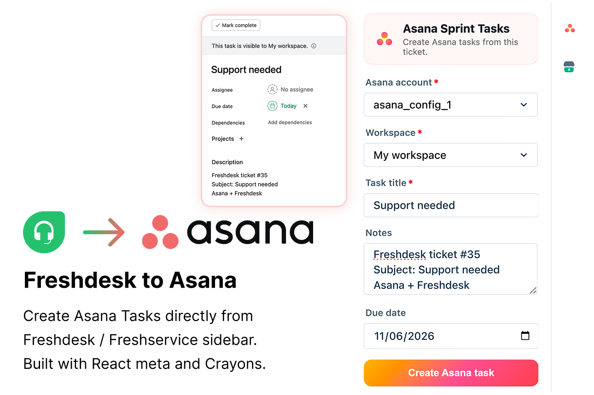

# Freshdesk to Asana

Create Asana tasks directly from the Freshdesk ticket sidebar. Built with [React Meta](https://developers.freshworks.com/docs/app-sdk/v3.1/support_ticket/front-end-apps/react-meta/), **Crayons React**, and Platform [OAuth](https://developers.freshworks.com/docs/app-sdk/v3.1/common/advanced-interfaces/oauth/) + [request templates](https://developers.freshworks.com/docs/app-sdk/v3.1/support_ticket/advanced-interfaces/request-method/).



| | |
|---|---|
| **Platform** | 3.1 |
| **Framework** | React Meta |
| **Surface** | `ticket_sidebar` |
| **OAuth** | Asana (account-level) |
| **Node** | 24.11.1 |
| **FDK** | 10.1.2 |

---

## What it does

Agents on a ticket can:

- Pick an **Asana OAuth account** and **workspace**
- Create a task with **title**, **notes** (prefilled from the ticket), and **due date**
- Apply the **default project** configured at install time (from iparams)
- Open the new task in Asana via permalink after creation

Asana API calls use request templates in [`config/requests.json`](config/requests.json). OAuth tokens are managed by the Freshworks platform — agents authorize once at install; the app reuses stored credentials per account.

---

## Features

- **Ticket sidebar** — create Asana tasks without leaving Freshdesk
- **OAuth to Asana** — secure access via [Asana OAuth 2.0](https://developers.asana.com/docs/oauth)
- **Multi-account support** — account-level OAuth; sidebar lists all connected accounts
- **Install-time defaults** — default workspace and project(s) via dynamic iparams
- **Prefilled context** — task notes include Freshdesk ticket ID, subject, and description
- **React Meta + Crayons** — `FwSelect`, `FwInput`, `FwTextarea` with Asana brand styling

---

## Prerequisites

| Requirement | Link / notes |
|-------------|----------------|
| **Node.js 24.x** | [Node downloads](https://nodejs.org/) |
| **FDK 10.1.2** | [Freshworks FDK setup](https://developers.freshworks.com/docs/app-sdk/v3.1/common/freshworks-cli-setup/) |
| **Freshdesk dev account** | e.g. `https://<your-domain>.freshdesk.com` |
| **Asana account** | [Asana](https://app.asana.com/) with permission to create tasks in the target workspace |
| **Asana OAuth app** | Created in the [Asana developer console](https://app.asana.com/0/my-apps) — see [Step 1](#step-1--create-an-asana-oauth-app) |

---

## Step 1 — Create an Asana OAuth app

1. Sign in to Asana and open the **[Asana developer console](https://app.asana.com/0/my-apps)** (My apps → **Create new app**).
   - Docs: [OAuth](https://developers.asana.com/docs/oauth)
2. Name the app (e.g. `Freshdesk Asana Tasks (dev)`) and create it.
3. Under **Configure → OAuth**, add these **Redirect URLs** (Freshworks OAuth callback endpoints):

   | Environment | Redirect URI |
   |-------------|--------------|
   | Local (`fdk run`) | `http://localhost:10001/auth/callback` |
   | Production / marketplace | `https://oauth.freshdev.io/auth/callback` |

   Freshworks docs: [OAuth configuration](https://developers.freshworks.com/docs/app-sdk/v3.1/common/advanced-interfaces/oauth/)

4. Under **Configure → Basic information**, copy:
   - **Client ID**
   - **Client secret** (generate if needed; shown once)
5. Under **OAuth**, confirm scopes include task creation for your workspace (the sample uses Asana’s `default` scope in [`config/oauth_config.json`](config/oauth_config.json)).

### Update `config/oauth_config.json`

Replace the placeholder credentials with your Asana app values:

```json
"client_id": "<your-asana-client-id>",
"client_secret": "<your-asana-client-secret>"
```

The sample uses dynamic host via `oauth_iparams.host` — agents enter `app.asana.com` during install (see Step 4).

---

## Step 2 — Install dependencies and validate

From this folder:

```bash
cd usecase+migration/oauth-samples
npm install
fdk config set global_apps.enabled true
fdk validate
npm test
```

`global_apps.enabled` is required because request templates are declared under `modules.common` — see [global app concepts](https://developers.freshworks.com/docs/app-sdk/v3.1/common/global-app-concepts/).

Expected: **0 platform errors** from `fdk validate`; unit tests pass via `npm test`.

---

## Step 3 — Run locally

```bash
fdk run
```

Keep this terminal running. Only one app can bind port `10001` at a time.

| Local URL | Purpose |
|-----------|---------|
| [http://localhost:10001/custom_configs](http://localhost:10001/custom_configs) | OAuth authorization + installation parameters |
| [http://localhost:10001/system_settings](http://localhost:10001/system_settings) | Account URLs and module subscription |
| [http://localhost:10001/web/test](http://localhost:10001/web/test) | Simulate serverless events (optional) |

Docs: [Test your app](https://developers.freshworks.com/docs/app-sdk/v3.1/support_ticket/basic-dev-tools/freshworks-cli-setup/test-your-app/)

---

## Step 4 — Configure OAuth and installation parameters

Open **[http://localhost:10001/custom_configs](http://localhost:10001/custom_configs)** with `fdk run` active.

### 4a — Authorize Asana OAuth

1. In the **Asana** OAuth section, set **host** to `app.asana.com`.
2. Click **Authorize** (or equivalent) and approve access in Asana.
3. Confirm the connected account appears (used by `getOAuthAccounts` in [`server/server.js`](server/server.js)).

If authorization fails, see [Troubleshooting](#troubleshooting).

### 4b — Set default workspace and projects

Installation fields are defined in [`config/iparams.json`](config/iparams.json) and populated dynamically by [`config/assets/iparams.js`](config/assets/iparams.js):

| Field | Purpose |
|-------|---------|
| **Reload Asana lists** | Check after OAuth is connected to refresh workspace/project dropdowns |
| **Asana Workspace** | Default workspace for tasks created from tickets |
| **Asana Projects** | One or more default projects (first project is used when creating tasks) |

**Order matters:**

1. Complete OAuth first (Step 4a).
2. Check **Reload Asana lists** (or change workspace) so dropdowns populate.
3. Select a **workspace**, then one or more **projects**.
4. Click **Install** / **Save**.

If workspace or project lists are empty, re-authorize OAuth and repeat the reload step.

---

## Step 5 — Test in Freshdesk

1. With **`fdk run`** still running, open Freshdesk in dev mode:
   - `https://<your-domain>.freshdesk.com/a/tickets/<id>?dev=true`
   - If the URL already has query params, append `&dev=true`.
2. When prompted, **allow local network access** (required for the sidebar iframe to reach `localhost:10001`).
3. Open the ticket **Apps** panel in the right sidebar and select this app.
4. Verify the UI loads:
   - **Asana account** dropdown lists your OAuth account
   - **Workspace** dropdown lists workspaces from Asana
   - **Task title** and **Notes** are prefilled from the ticket
5. Optionally set a **Due date**, then click **Create Asana task**.
6. Confirm the success notification and that Asana opens the new task (permalink).

### What to verify

| Check | Expected result |
|-------|-----------------|
| Sidebar loads | Header shows “Asana Sprint Tasks” |
| OAuth connected | Account dropdown is not empty |
| Workspace list | Populated after OAuth + iparams workspace selected |
| Task creation | New task in Asana with ticket notes (`Freshdesk ticket #…`) |
| Default project | Task appears in the project chosen at install |

---

## OAuth redirect URIs (Freshworks)

Register **both** URIs in your Asana OAuth app before testing:

| Environment | Redirect URI |
|-------------|--------------|
| Local | `http://localhost:10001/auth/callback` |
| Production | `https://oauth.freshdev.io/auth/callback` |

The redirect URI in Asana must **exactly match** what Freshworks sends during authorization.

---

## Folder structure

```text
oauth-samples/
├── app/                              # Frontend (React Meta + Crayons)
│   ├── sidebar.html                  # Ticket sidebar entry
│   ├── components/
│   │   ├── AsanaMain.jsx             # Bootstrap + Crayons loader
│   │   ├── AsanaApp.jsx              # App shell
│   │   ├── AsanaLogo.jsx             # Asana logo component
│   │   └── CreateTaskPanel.jsx       # Create-task form
│   ├── utils/asana-api.js            # OAuth, workspaces, task helpers
│   ├── public/icon.svg               # Marketplace / sidebar icon
│   └── styles/                       # style.css, images/
│
├── server/
│   └── server.js                     # getOAuthAccounts SMI
│
├── config/
│   ├── oauth_config.json             # Asana OAuth integration
│   ├── iparams.json                  # Workspace / project install fields
│   ├── requests.json                 # Asana API request templates
│   └── assets/iparams.js             # Dynamic iparam loaders
│
├── tests/                            # Vitest unit tests
├── manifest.json
├── asana-banner.png                  # README banner
└── README.md
```

---

## Request templates

| Template | Method | Purpose |
|----------|--------|---------|
| `create_asana_task` | POST | Create task in Asana |
| `get_asana_workspace` | GET | List workspaces for OAuth account |
| `get_asana_projects` | GET | List projects in a workspace |

All templates use `Authorization: Bearer <%= access_token %>` with `"oauth": "asana"` in options.

---

## Development commands

```bash
fdk validate          # Platform + lint validation
fdk run               # Local dev server (port 10001)
npm test              # Vitest unit tests
fdk pack              # Build submission package
```

---

## Troubleshooting

### App not visible in the sidebar

- **`fdk run` must be running** in this app folder (not another app on port `10001`).
- URL must include **`?dev=true`** (or `&dev=true`).
- Open the **Apps** section in the ticket sidebar.
- Restart **`fdk run`** after changing `manifest.json`.
- If the iframe is blank, allow **insecure localhost** / local network access — see [Test your app](https://developers.freshworks.com/docs/app-sdk/v3.1/support_ticket/basic-dev-tools/freshworks-cli-setup/test-your-app/).

### OAuth / “No Asana OAuth accounts found”

- Complete authorization at [custom_configs](http://localhost:10001/custom_configs) before opening a ticket.
- Set **host** to exactly `app.asana.com` (no `https://` prefix).
- Verify **Client ID** and **Client secret** in [`config/oauth_config.json`](config/oauth_config.json) match your Asana app.
- Redirect URLs in Asana must include **`http://localhost:10001/auth/callback`** for local dev.
- Stale local OAuth: stop `fdk run`, delete `.fdk/localstore`, run again, and re-authorize.

### Workspace / project dropdowns empty at install

- Authorize OAuth **before** checking **Reload Asana lists**.
- Use [custom_configs](http://localhost:10001/custom_configs), not only system settings.
- Re-authorize if tokens expired; check `log/fdk.log` for API errors.

### Task creation fails

- Confirm OAuth is authorized and workspace is selected in the sidebar.
- Ensure the install-time **project** still exists and is not archived in Asana.
- Authorizing user needs permission to create tasks in the workspace/project.
- Check browser devtools and `log/fdk.log` for Asana API error responses.

---

## Security

- **OAuth tokens** — stored and refreshed by the Freshworks platform; never exposed in frontend code.
- **Client secret** — belongs in `oauth_config.json` for development; use secure marketplace credential handling for production.
- **Request templates** — access tokens injected server-side via `<%= access_token %>`.

---

## Related docs

- [Asana OAuth](https://developers.asana.com/docs/oauth)
- [Asana Tasks API](https://developers.asana.com/reference/createtask)
- [Freshworks OAuth](https://developers.freshworks.com/docs/app-sdk/v3.1/common/advanced-interfaces/oauth/)
- [React Meta framework](https://developers.freshworks.com/docs/app-sdk/v3.1/support_ticket/front-end-apps/react-meta/)
- [Installation parameters](https://developers.freshworks.com/docs/app-sdk/v3.1/support_ticket/app-settings/installation-parameters/)
